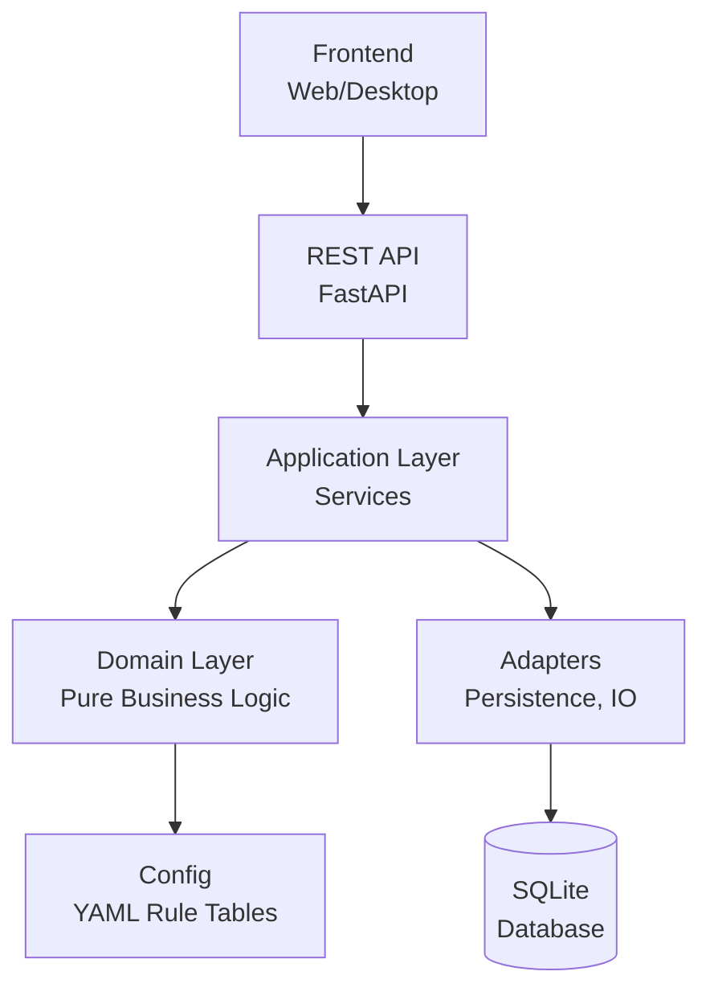

# WH40k Colony Manager

**A Python engine for organizing and tracking a Warhammer 40k Rogue Trader Colony**

[](LICENSE)
[](https://www.python.org/downloads/)
[](TESTING_TODO.md)
[](https://github.com/astral-sh/ruff)
[](https://mypy-lang.org/)
[](docs/deployment.md)
[](.github/workflows/ci-cd.yml)

---

## Table of Contents

- [Overview](#overview)
- [Features](#features)
- [Quick Start](#quick-start)
- [Architecture](#architecture)
- [API Usage](#api-usage)
- [Documentation](#documentation)
- [Development](#development)
- [Contributing](#contributing)
- [License](#license)

---

## Overview

The **WH40k Colony Manager** is a comprehensive Python engine designed to replace manually-maintained spreadsheets for tracking Warhammer 40k Rogue Trader colonies. It provides:

- **Core colony stats**: Size, Complacency, Order, Productivity, Piety, and derived Profit Factor
- **Infrastructure management**: Hard Infrastructure and Support Upgrades with conditional bonuses
- **Representative system**: RPG stats/skills/talents that modify colony behavior
- **State transitions**: Threshold-based events (Anarchy, Placated, Productive, etc.)
- **Modifier tracking**: Record GM-created modifiers, dice roll results, and event effects

The engine exposes a REST API for consumption by external frontends (web UI, desktop app, etc.).

---

## Features

### 🎯 Core Features

- **Colony Management**: Track all colony stats with automatic calculations
- **Infrastructure System**: Manage working/faulty infrastructure with stacking bonuses
- **Support Upgrades**: Limited by colony size, with custom stat choices
- **Representatives**: Assign Judges, Cardinals, or Satraps with unique personalities
- **Events & Development**: GM-created events and long-term development plans
- **Multi-User Support**: Role-based access control (Owner, Admin, Editor, Viewer)
- **Export/Import**: Portable colony files for backup and sharing
- **Audit Logging**: Complete change history for all colony modifications

### 🛡️ Technical Features

- **Clean Architecture**: Domain logic isolated from I/O and frameworks
- **Type-Safe**: Full type hints with mypy validation
- **Tested**: 695+ passing tests with property-based testing
- **RESTful API**: FastAPI-based REST API with OpenAPI documentation
- **Real-time Updates**: Server-Sent Events for live notifications
- **Security**: JWT authentication, rate limiting, password validation

### ⚠️ Scope Clarification

**This application is a tracking and organization tool, NOT a game automation system.**

What the application does:

- ✅ Track colony stats and calculate derived values
- ✅ Store infrastructure, upgrades, and their states
- ✅ Record modifiers created by the GM
- ✅ Maintain audit logs and history
- ✅ Provide API access for frontends

What the application does NOT do:

- ❌ Automate dice rolls (GM enters results manually)
- ❌ Run automatic event cycles or time-based mechanics
- ❌ Make gameplay decisions or resolve game mechanics
- ❌ Replace the GM during gameplay

All game mechanics happen at the table during the actual play session. The GM
manually enters results, modifiers, and outcomes into the system.

---
---

## Quick Start

### Option 1: Docker (Recommended)

The easiest way to run the application is with Docker Compose:

```bash
# Clone the repository
git clone https://github.com/yourusername/WH40k_Colony_Manager.git
cd WH40k_Colony_Manager

# Build and start both frontend and backend
docker compose up -d --build

# Access the application
# Frontend: http://localhost:3000
# Backend API: http://localhost:8001
# API Documentation: http://localhost:8001/docs
```

For detailed Docker deployment instructions, see [DOCKER_GUIDE.md](DOCKER_GUIDE.md).

### Option 2: Local Development (no containers)

Docker (`docker compose up -d --build`) and local development run the **same**
real backend + real frontend — the mock Express server is *not* involved in
either. Docker wraps both in containers (frontend nginx on `:3000`, backend
exposed on `:8001`); local development starts them as two plain processes
(backend on `:8000`, frontend on `:3000`). Use whichever suits you: Docker
for a single-command environment, local for faster feedback loops.

#### Prerequisites

- Python 3.12 or higher
- uv package manager (recommended) or pip
- Node.js 20+ (for frontend development)

#### Installation

```bash
git clone https://github.com/yourusername/WH40k_Colony_Manager.git
cd WH40k_Colony_Manager

# Install backend dependencies
uv sync --no-build --extra dev

# Install frontend dependencies
npm install
```

#### Run the backend (terminal 1)

```bash
uv run uvicorn colony_manager.adapters.api.app:create_app --factory --reload
```

- Backend API: <http://localhost:8000>
- API docs (Swagger UI, cookie-based auth): <http://localhost:8000/docs>

The SQLite database is created at `./colony_manager.sqlite` on first startup.

> **Stale database note:** if you have a `colony_manager.sqlite` created by an
> older schema (e.g. API returns 500 on `POST /colonies` with
> `table colonies has no column named founder_name`), either delete the file
> so the current schema is recreated, or apply migrations with
> `alembic upgrade head` (`init_db()` only *creates* tables, it never alters
> existing ones — see `src/colony_manager/adapters/persistence/db.py`).

#### Run the frontend against the real backend (terminal 2)

```bash
# Point the frontend at the real backend once. This file is gitignored
# (`.env.local`). The one variable that matters:
#   VITE_API_BASE_URL=http://localhost:8000/api/v1
# Optional: VITE_DEV_MODE=true shows the one-click demo-login panel. Leave it
# unset unless you want that — it also flips LoginScreen's unit tests to
# dev-mode expectations, so run `npm test` with it off.

npm run dev:app
```

- Frontend: <http://localhost:3000> (Vite dev server)

> **Which dev script is which**
>
> - `npm run dev:app` — the real frontend talking to the **real backend**
>   (`:8000`). Use this for Option A local development, and for manual / E2E
>   testing against the real API.
> - `npm run dev:mock` (alias of `npm run dev`) — the real frontend served
>   together with the **mock Express backend** (`server.ts`, same `:3000` origin) that
>   simulates the API for UI work when you don't want the Python backend
>   running. The demo users (LordCaptain, ArchMagos, Servitor) exist *only* in
>   this mock.

#### Creating users

The backend seeds **no** users, and `/auth/register` only ever creates
`viewer` accounts (a viewer can log in and view, but the app blocks colony
creation). Which you need depends on what you want to test:

1. **A viewer (any role test / login check)** — register over the API:

   ```bash
   curl -X POST http://localhost:8000/api/v1/auth/register \
     -H "Content-Type: application/json" \
     -d '{"username":"Trader","email":"trader@example.com","password":"TestP@ss123"}'
   ```

2. **An elevated user (`colony_manager` / `admin`)** — needed to charter
   colonies and manage users. Self-service can't do this (privileged roles are
   admin-only), so create the user directly in the backend's SQLite database.
   Save the snippet below as `create_local_user.py` (a one-time debug script —
   it's covered by the Debug-scripts ignore rules in `.gitignore`, but still
   delete it after use), then with the **backend stopped** run:

   ```bash
   uv run python create_local_user.py
   ```

   ```python
   """create_local_user.py — one-off local helper (delete after use).

   Mirrors tests/conftest.py::_bootstrap_user: creates an elevated user in the
   same SQLite database the backend uses (./colony_manager.sqlite), bypassing
   self-service registration which is locked to the viewer role.
   """
   from pathlib import Path

   from colony_manager.adapters.persistence.db import build_database_url, init_db
   from colony_manager.adapters.persistence.user_repository_impl import (
       SqlAlchemyUserRepository,
   )
   from colony_manager.domain.models.user import User, UserRole
   from colony_manager.domain.util.auth import hash_password

   if __name__ == "__main__":
       db_path = Path("colony_manager.sqlite").resolve()
       init_db(db_path)
       repo = SqlAlchemyUserRepository(build_database_url(db_path))
       repo.create(
           User(
               username="LordCaptain",
               email="lordcaptain@example.com",
               password_hash=hash_password("TestP@ss123"),
               role=UserRole.COLONY_MANAGER,
               is_active=True,
           )
       )
       print(f"Created user 'LordCaptain' (colony_manager) in {db_path}")
   ```

### First Steps

1. **Register a user**: `POST /api/v1/auth/register`
2. **Login**: `POST /api/v1/auth/login`
3. **Create a colony**: `POST /api/v1/colonies`
4. **Add infrastructure**: `POST /api/v1/colonies/{id}/infrastructure`
5. **Assign a representative**: `POST /api/v1/representatives/{id}/assign`

See the [API Guide](docs/api.md) for detailed examples.

---

## Architecture

### System Overview



### Layered Architecture

```
src/colony_manager/
├── domain/              # Pure business logic, zero I/O
│   ├── models/          # Colony, Representative, Infrastructure, etc.
│   ├── rules/           # Calculation rules (stateless functions)
│   └── ports/           # Repository interfaces (Protocol/ABC)
│
├── application/         # Use cases / services
│   └── services/        # Orchestrates domain + ports
│
├── adapters/            # External world implementations
│   ├── persistence/     # SQLite repository implementations
│   ├── io/              # JSON/YAML import & export
│   ├── api/             # FastAPI routers, schemas
│   └── cli/             # Typer command-line entry points
│
└── config/              # Rule-table data (YAML)
    ├── colony_types.yaml
    ├── rule_tables.yaml
    └── personalities.yaml
```

### Key Design Principles

1. **Domain logic has zero I/O** — No FastAPI, SQLAlchemy, or file-system access in domain code
2. **Game rule data is data, not code** — Numeric tables in YAML config files
3. **Don't abstract preemptively** — Only introduce abstractions when used in ≥2 places
4. **Dependencies point inward** — `adapters → application → domain`

See [Architecture Documentation](docs/architecture.md) for details.

---

## API Usage

### Authentication Example

```bash
# Register
curl -X POST http://localhost:8000/api/v1/auth/register \
  -H "Content-Type: application/json" \
  -d '{"username": "commander", "email": "cmdr@example.com", "password": "SecureP@ssw0rd!"}'

# Login
curl -X POST http://localhost:8000/api/v1/auth/login \
  -H "Content-Type: application/json" \
  -d '{"username": "commander", "password": "SecureP@ssw0rd!"}'
```

### Create Colony Example

Authentication is cookie-based: log in to establish a session cookie, then send it with your request along with a CSRF token for state-changing calls.

```bash
# 1. Log in — stores the session cookie in cookies.txt
curl -c cookies.txt -X POST http://localhost:8000/api/v1/auth/login \
  -H "Content-Type: application/json" \
  -d '{"username": "commander", "password": "SecureP@ssw0rd!"}'

# 2. Fetch the CSRF token (also sets the JS-readable CSRF cookie)
curl -b cookies.txt -c cookies.txt http://localhost:8000/api/v1/auth/csrf-token

# 3. Create a colony — send the session cookie and echo the CSRF token
curl -b cookies.txt -X POST http://localhost:8000/api/v1/colonies \
  -H "Content-Type: application/json" \
  -H "X-CSRF-Token: <token_from_step_2>" \
  -d '{"name": "New Terra", "colony_type": "forge_world", "base_size": 5}'
```

### API Documentation

Interactive API documentation is available at:

- **Swagger UI**: <http://localhost:8000/docs>
- **ReDoc**: <http://localhost:8000/redoc>

Complete API reference: [`docs/api.md`](docs/api.md) (authoritative schema: `docs/api/openapi.json`)

---

## Documentation

Full index: [`docs/README.md`](docs/README.md). Key documents:

| Document | Description |
|----------|-------------|
| [Business Analysis](docs/business_analysis.md) | Game rules & calculations (single source of truth) |
| [Rules Reference](docs/colony-manager-rules-reference.md) | Rulebook reference |
| [Architecture](docs/architecture.md) | System architecture and design decisions |
| [Domain Model](docs/domain-model.md) | Entities, stats, lore states, Profit Factor |
| [API Guide](docs/api.md) | Compact endpoint map (authoritative: `docs/api/openapi.json`) |
| [Frontend Architecture](docs/frontend-architecture.md) | Frontend stack and API integration |
| [Configuration](docs/configuration.md) | YAML rule tables + environment variables |
| [Deployment](docs/deployment.md) | Docker / bare deployment guide |
| [Security Configuration](docs/SECURITY_CONFIGURATION.md) | Security hardening guide |
| [Troubleshooting](docs/troubleshooting.md) | Common issues and solutions |
| [UI Design System](docs/UI_DESIGN_SYSTEM.md) | Mechanicum design system and components |
| [Testing](docs/testing.md) | Backend + frontend test strategy |

### Project Management

| Document | Description |
|----------|-------------|
| [Testing TODO](TESTING_TODO.md) | Test coverage and strategy |
| [Scope Clarifications](docs/SCOPE_CLARIFICATIONS.md) | Important scope boundaries |

### Archived Documents

Historical documents moved to [`docs/archive/`](docs/archive/) — including the
former API / deployment / planning docs. Kept for history; see
`docs/README.md` for the current set.

---

## Development

### Running Tests

```bash
# Run all tests
uv run pytest -q

# Run with coverage
uv run pytest --cov=colony_manager

# Run specific test file
uv run pytest tests/domain/test_colony.py -v
```

#### Frontend E2E (Playwright) — on demand

E2E specs live in `e2e/` and are **not** part of `npm test` — they boot a real
browser, so run them on demand for large/UI changes or in CI. They target the
self-contained mock stack (`npm run dev:mock`, `server.ts` on `:3000`), which
serves the SPA together with a cookie-authenticated mock of the API on the same
origin — no Python backend, database, or seeded users required.
`playwright.config.ts` forwards the SPA to that same origin
(`VITE_API_BASE_URL=http://localhost:3000/api/v1`), overriding the gitignored
`.env.local` that points at the real backend on `:8000`.

```bash
# One-time: install the Playwright Chromium browser
npm run test:e2e:install

# Run all E2E specs (starts the mock server automatically)
npm run test:e2e

# Run headed, to watch what the browser does
npm run test:e2e:headed
```

First scenario: `e2e/not-logged-in.spec.ts` (an anonymous visitor is shown the
login screen, not the dashboard). Type-check the specs without running them:

```bash
npm run typecheck:e2e
```

### Code Quality

```bash
# Format code
uv run ruff format .

# Lint code
uv run ruff check .

# Type checking
uv run mypy src/colony_manager
```

### Project Layout

See the [Architecture](#architecture) section above for the complete project structure.

---

## Contributing

We welcome contributions! Please follow these steps:

### 1. Fork and Clone

```bash
git clone https://github.com/yourusername/WH40k_Colony_Manager.git
cd WH40k_Colony_Manager
```

### 2. Set Up Development Environment

```bash
uv sync --no-build --extra dev
```

### 3. Create a Branch

```bash
git checkout -b feature/your-feature-name
```

### 4. Make Changes

- Follow the existing code style (Google-style docstrings, full type hints)
- Add tests for new functionality
- Update documentation as needed

### 5. Run Tests and Linters

```bash
uv run pytest -q
uv run ruff check .
uv run mypy src/colony_manager
```

### 6. Submit a Pull Request

Push your changes and open a PR on GitHub. Include:

- Description of changes
- Link to any related issues
- Test coverage details

### Code Style

- **Type Hints**: Full type hints on all public functions
- **Docstrings**: Google-style for all public modules/classes/functions
- **Formatting**: ruff (black-compatible)
- **Linting**: ruff with project-specific rules

See [CONTRIBUTING.md](CONTRIBUTING.md) for detailed guidelines.

---

## License

This project is licensed under the MIT License - see the [LICENSE](LICENSE) file for details.

---

## Support

For issues, questions, or feature requests, please:

1. Check existing [documentation](docs/)
2. Search existing [GitHub issues](https://github.com/yourusername/WH40k_Colony_Manager/issues)
3. Open a new issue with detailed description

---

**The Emperor Protects** 🦅
